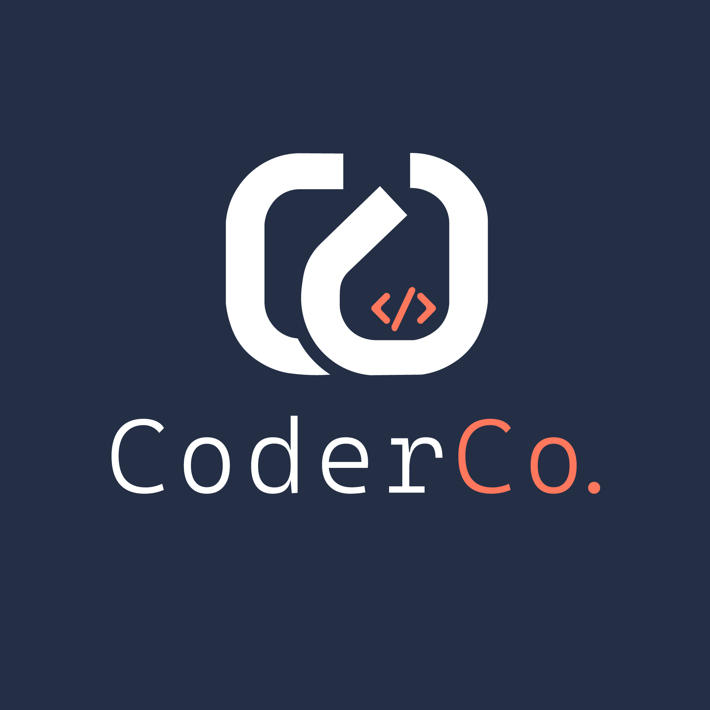

<div align="center">
    
</div>

# CoderCo Assignment 1 - Open Source App Hosted on ECS with Terraform 🚀

This project is based on Amazon's Threat Composer Tool, an open source tool designed to facilitate threat modeling and improve security assessments. You can explore the tool's dashboard here: [Threat Composer Tool](https://awslabs.github.io/threat-composer/workspaces/default/dashboard)

## Task/Assignment 📝

- Create your own repository and complete the task there. You may create a `app` in your repo and copy all the files in this directory into it. Or alternatively, you can use this directory as is. Your choice.

- Your task will be to create a container image for the app, push it to ECR (recommended) or DockerHub. Ideally, you should use a CI/CD pipeline to build, test, and push the container image.

- Deploy the app on ECS using Terraform. All the resources should be provisioned using Terraform. Use TF modules.

- Make sure the app is live on `https://tm.<your-domain>` or `https://tm.labs.<your-domain>`

- App must use HTTPS. Hosted on ECS. Figure out the rest. Once app is live, add screenshots to the README.md file.

- Add architecture diagram of how the infrastructure is setup. (Use Lucidchart or draw.io or mermaid) You are free to use any diagramming tool.

## Local app setup 💻

```bash
yarn install
yarn build
yarn global add serve
serve -s build

#yarn start
http://localhost:3000/workspaces/default/dashboard

## or
yarn global add serve
serve -s build
```

## Useful links 🔗

- [Terraform AWS Registry](https://registry.terraform.io/providers/hashicorp/aws/latest/docs)
- [Terraform AWS ECS](https://registry.terraform.io/providers/hashicorp/aws/latest/docs/resources/ecs_cluster)
- [Terraform Docs](https://www.terraform.io/docs/index.html)
- [ECS Docs](https://docs.aws.amazon.com/ecs/latest/userguide/what-is-ecs.html)

## Advice & Tips �

- This is just a simple app, you may use another app if you'd like. 
- Use best practices for your Terraform code. Use best practices for your container image. Use best practices for your CI/CD pipeline.